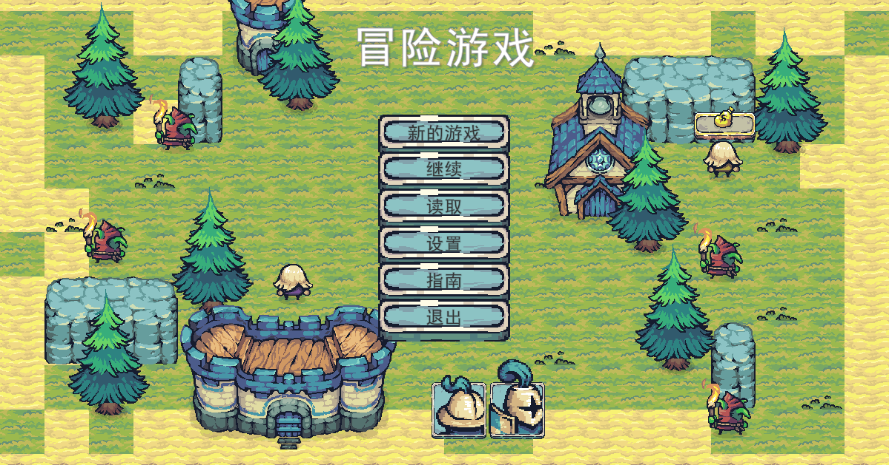
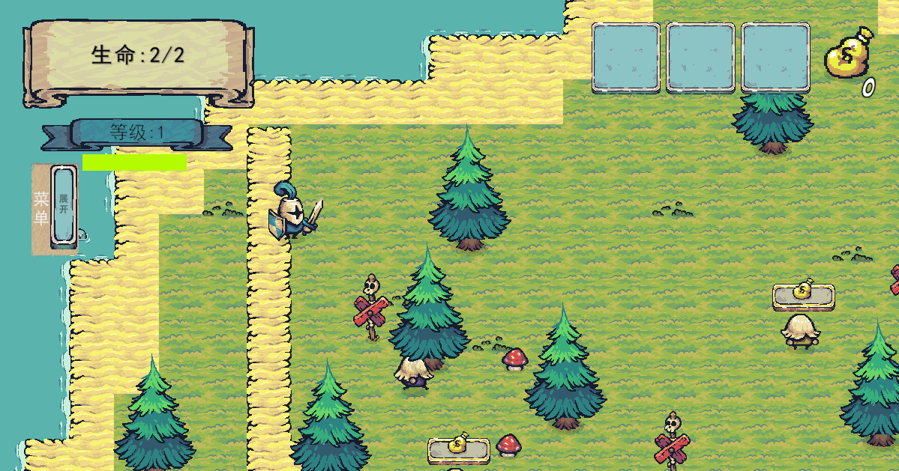
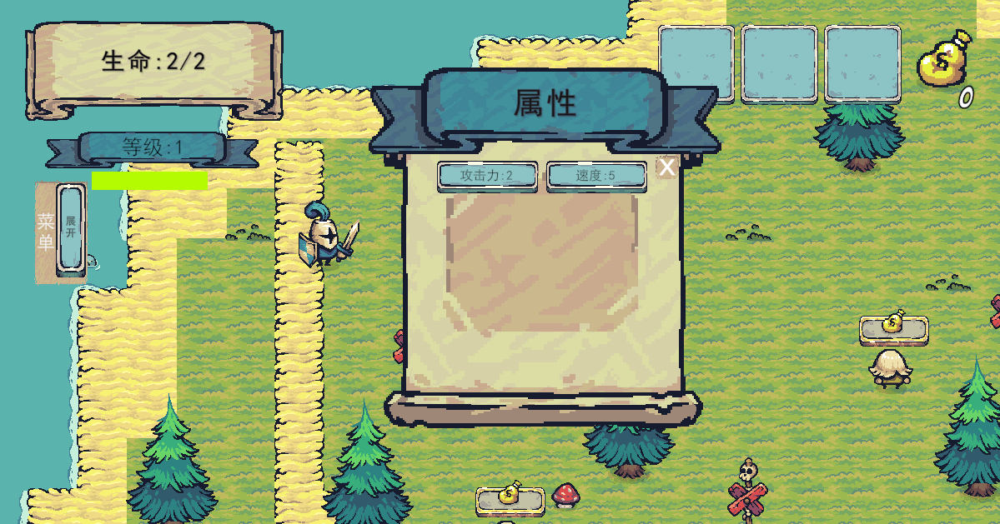
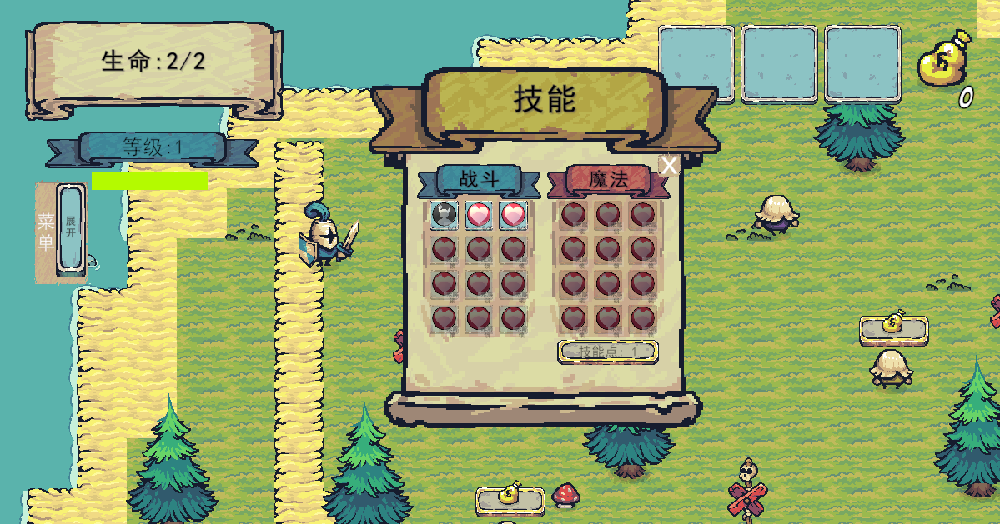
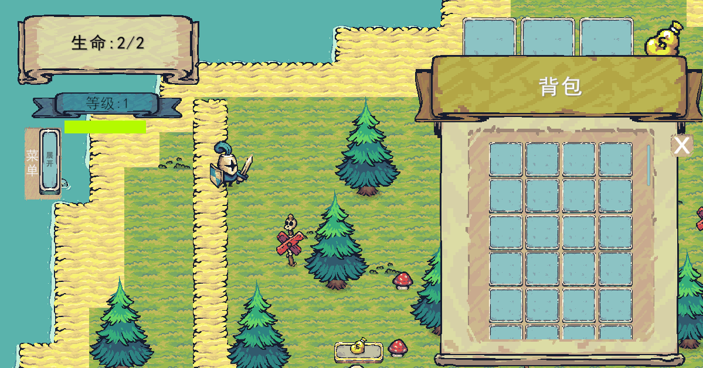
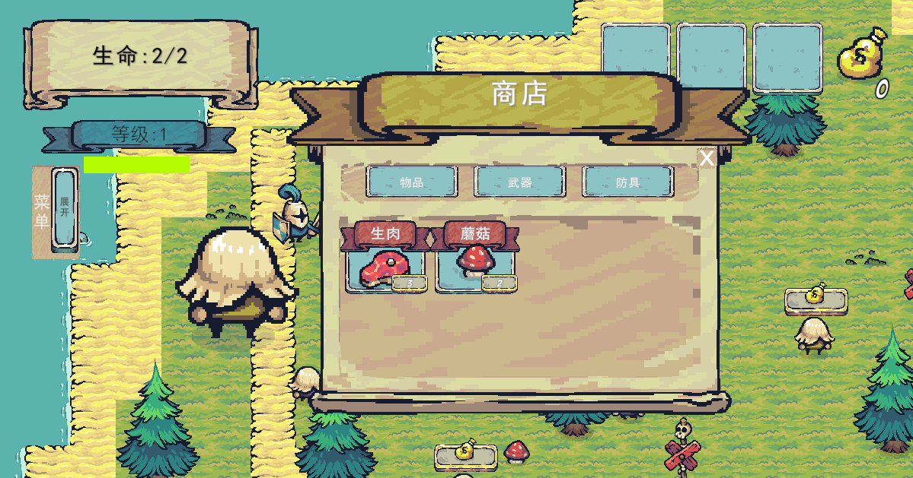
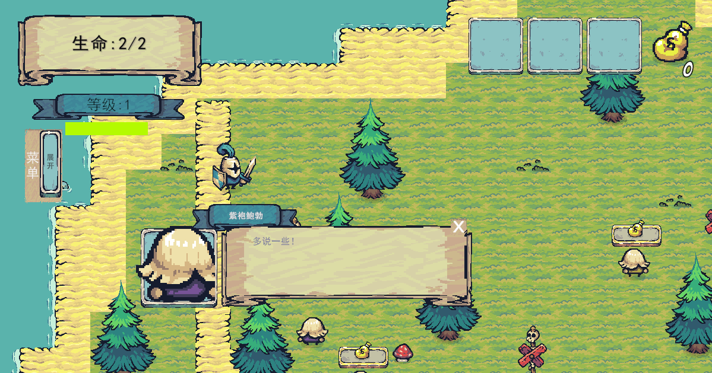
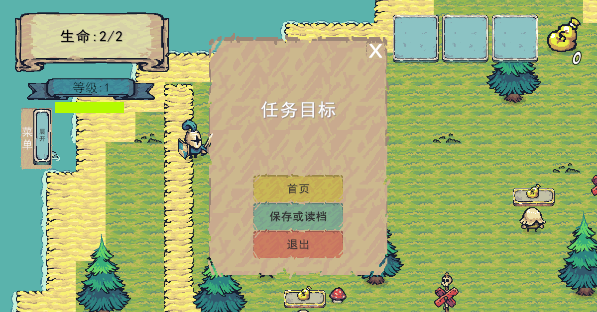
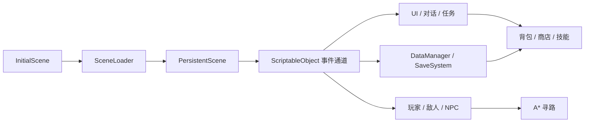

# My ARPG

基于团结引擎（Unity 兼容工作流）开发的 2D 俯视角 ARPG 原型。项目围绕场景加载、战斗、NPC 对话、任务、背包、商店、技能树与存档系统展开，重点展示模块化玩法系统和 ScriptableObject 事件驱动架构。

> English documentation is not currently maintained. 本仓库默认使用中文文档。



## 项目状态

- 类型：学习 / 作品集项目
- 当前版本：`1.0`
- 编辑器：团结引擎 `1.8.5`（项目序列化版本 `2022.3.62t7`）
- 默认入口：`Assets/Scenes/InitialScene.unity`
- 主要语言：C#

## 核心功能

- 近战 / 远程战斗模式切换，以及角色属性、死亡和重试流程
- 多场景异步加载、持久场景管理与淡入淡出过渡
- 树状 NPC 对话、条件分支、一次性对话和对话历史
- 任务板、任务日志、多目标追踪、奖励发放与状态机
- 背包、拾取、使用、出售、丢弃和商店交互
- 技能树、能力面板与统一 UI 管理
- 基于接口注册表的 JSON 存档 / 读档
- 支持八方向移动和动态重寻路的 A* 寻路
- 使用 ScriptableObject 事件通道降低系统间耦合

## 游戏截图

以下画面均由当前项目实际运行生成。

| 场景探索 | 属性面板 |
| --- | --- |
|  |  |

| 技能树 | 背包系统 |
| --- | --- |
|  |  |

| 商店系统 | NPC 对话 |
| --- | --- |
|  |  |

| 系统菜单 |
| --- |
|  |

## 架构概览



## 快速开始

1. 安装团结引擎 `1.8.5`，或使用能够读取 `2022.3.62t7` 项目的兼容编辑器。
2. 克隆仓库，并通过编辑器打开仓库根目录。
3. 等待 Package Manager 完成 Addressables、Cinemachine、Input System、TextMesh Pro 等依赖的恢复与导入。
4. 按照 [第三方素材说明](THIRD_PARTY_ASSETS.md) 在本地恢复素材文件。公开仓库不包含禁止再分发的原始美术和字体文件。
5. 从 `Assets/Scenes/InitialScene.unity` 进入 Play Mode。

只进行代码审阅时，无需恢复素材；脚本、场景、预制体、配置、`.meta` 和架构文档均已保留。

## 操作方式

| 按键 | 功能 |
| --- | --- |
| `WASD` | 移动 |
| `Q` | 切换近战 / 远程模式 |
| `J` | 当前模式下攻击 |
| `1` | 打开能力面板 |
| `2` | 打开技能面板 |
| `F` | 与商店交互 |
| `T` | 打开 / 推进 NPC 对话 |
| `C` | 打开任务菜单 |
| `Esc` | 打开退出、存档与返回标题菜单 |

## 项目结构

```text
Assets/
├─ Scripts/
│  ├─ Gameplay/          # 存档等核心玩法服务
│  ├─ Inventory/         # 物品、槽位、拾取与使用
│  ├─ Player/            # 移动、战斗、装备与属性
│  ├─ SaveAndLoad/       # 存档数据与接口
│  ├─ Scene/             # 场景切换
│  ├─ ScriptableObjects/ # 数据资源与事件通道
│  ├─ UI/                # 对话、任务、商店、技能树与菜单
│  └─ Units/             # 敌人、NPC 与商店 NPC
├─ Scenes/               # 启动、持久、菜单和游戏场景
├─ Prefabs/              # 玩家、敌人、交互物与 UI 预制体
├─ GameSO/               # 任务、对话、物品、场景和事件资源
├─ AddressableAssetsData/
└─ Sprites/              # 仅保留可公开的项目数据和导入元数据
Docs/                    # 游玩、系统解析、UML 与构建文档
Packages/                # Unity Package Manager 依赖
ProjectSettings/         # 引擎项目配置
Tools/                   # Android 构建辅助脚本
```

## 设计要点

- `ISaveable` + `DataManager` 注册表统一组织可持久化对象，`SaveSystem` 使用 Newtonsoft.Json 完成序列化和文件读写。
- `DialogSO` 组成树状对话图，条件节点结合物品与对话历史选择分支。
- 任务状态按 `Idle → Accepted → IsToComplete → Completed` 推进，并通过事件系统发放奖励。
- `AStarNodeManager`、`AStarPathFinder` 和 `MovementController` 分别承担网格、算法和路径消费职责。
- 跨系统通信优先使用 ScriptableObject 事件通道，并在 `OnEnable` / `OnDisable` 中成对订阅和注销。

## 文档

- [完整游玩指南](Docs/完整游玩指南.md)
- [项目系统解析](Docs/项目完全解析_从入门到面试.md)
- [ScriptableObject 事件系统详解](Docs/ScriptableObject事件系统详解.md)
- [对象池优化讲解](Docs/对象池优化讲解.md)
- [Android 构建指南](Docs/安卓构建指南.md)
- [UML 图与 PlantUML 源文件](Docs/UML)

## 构建注意事项

- Addressables 的活动数据构建器应保持为 Packed Mode。
- `InitialScene` 必须保留在 Build Settings 中；它负责继续加载 `PersistentScene` 和游戏场景。
- 重命名场景或 ScriptableObject 后，应检查 Addressables 条目和 Inspector 引用是否失效。
- Android 构建前请阅读项目内的 Android 构建指南，并为正式发行配置自己的 keystore。

## 已知限制

- 标题界面的 `Settings` 入口尚未实现。
- 部分菜单依赖玩家处于交互范围内，无法在任意位置直接打开。
- 公开源码版不附带受第三方许可限制的原始美术和字体，因此首次克隆后需要自行恢复素材才能得到完整视觉效果。

## 第三方内容

项目开发中使用了 [Tiny Swords by Pixel Frog](https://pixelfrog-assets.itch.io/tiny-swords)。其当前许可允许在项目中使用和修改，但禁止重新分发、转售或重新打包素材，因此相关原始文件未放入公开源码目录。完整清单和处理方式见 [THIRD_PARTY_ASSETS.md](THIRD_PARTY_ASSETS.md)。

TextMesh Pro 等 Unity / 团结引擎组件及其资源遵循各自许可；Newtonsoft.Json 通过 Package Manager 恢复，不在 `Assets/Plugins` 中重复提交 DLL。

## 许可证

本仓库中由项目作者创作的源代码和文档采用 [GNU GPL v3](LICENSE)。第三方组件、素材、字体及商标不因此改为 GPL，仍受各自许可约束。
